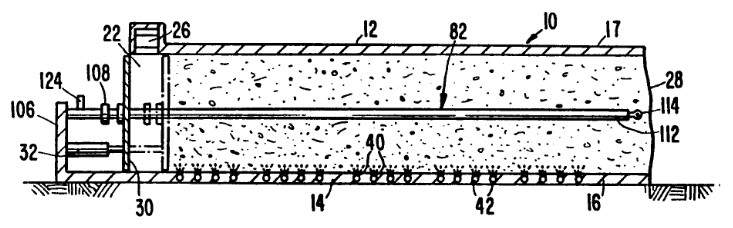
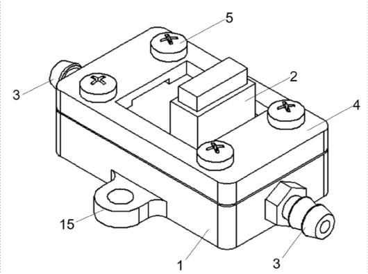
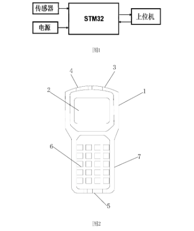

# 3.2 Análisis de patentes relacionadas

## 3.2.1 Título: Aparato y método de control de temperatura en un sistema de compostaje mediante el cual se mueve la materia orgánica para efectuar el compostaje

**Código:** US5049486A

### Resumen

Método y aparato para el control de la temperatura en una masa de materia orgánica que se desplaza a través de un recipiente de compostaje. Una sonda fija y alargada se extiende a través del recipiente de un extremo al otro. Varios dispositivos de medición de temperatura están montados a lo largo de la sonda. Esta puede extenderse a través de un pistón de compactación y estar provista de un manguito para permitir el movimiento del pistón con respecto a la sonda. Un dispositivo de desacoplamiento permite separar la sonda de la base de montaje, y un dispositivo de extracción permite extraer la sonda del recipiente para su reemplazo. La sonda proporciona un método para controlar la temperatura en la masa y un método de compostaje mediante el control de la temperatura en la masa y su regulación en función de la misma.

### Imagen

### Beneficios para nuestro proyecto

La patente US5049486A beneficia al desarrollo del presente prototipo debido a que valida el uso de sensores internos para el monitoreo continuo de la temperatura dentro del compostaje. Asimismo, demuestra que la temperatura en la masa orgánica no se distribuye de manera uniforme, por lo que es necesario el empleo de una sonda enterrada con varios puntos de medición que permita obtener datos más precisos y representativos del proceso de descomposición. Del mismo modo, la patente aporta como referencia el diseño modular y extraíble de la sonda, facilitando el mantenimiento y reemplazo de los componentes electrónicos.

### Link

https://worldwide.espacenet.com/patent/search?q=pn%3DUS5049486A

---

## 3.2.2 Título: Dispositivo de monitorización de temperatura y humedad para circuito de gas de monitorización de COVT (compuestos orgánicos volátiles totales)

**Código:** CN222964686U

### Resumen

El modelo de utilidad se refiere a un dispositivo de monitoreo de temperatura y humedad para un circuito de gas de monitoreo de COVT (compuestos orgánicos volátiles totales). Este dispositivo comprende una base y un sensor de temperatura y humedad. La base cuenta con una cavidad de monitoreo, y en su parte superior dispone de un puerto de montaje que comunica con dicha cavidad. El sensor de temperatura y humedad está montado herméticamente en el puerto de montaje, y la cavidad de monitoreo se comunica con el puerto de montaje. El sensor de temperatura se utiliza para monitorear la temperatura y la humedad del gas que fluye a través de la cavidad de monitoreo. La base también cuenta con un canal de entrada y un canal de salida de aire que comunican con la cavidad de monitoreo. Estos canales se ubican a ambos lados de la cavidad de monitoreo y se conectan a una tubería de aire del circuito de monitoreo. Según la invención, se logra un monitoreo efectivo y preciso de la temperatura y la humedad del gas externo que ingresa al circuito de monitoreo, lo que permite obtener datos más precisos sobre la concentración de COVT en el aire.

### Imagen

### Beneficios para nuestro prototipo

La patente CN222964686U beneficia al desarrollo del presente prototipo debido a que valida el uso de sensores de temperatura y humedad integrados en conductos o circuitos de flujo de gases para obtener mediciones más precisas durante procesos de monitoreo ambiental. Asimismo, aporta como referencia el empleo de cavidades de monitoreo y canales de entrada y salida de aire que permiten proteger los sensores y mejorar la estabilidad de las mediciones frente a condiciones externas. Esto resulta útil para el diseño del sistema propuesto, debido a que respalda la incorporación de sensores protegidos y ubicados estratégicamente dentro del compostador para poder monitorear variables internas relacionadas con el proceso de descomposición. Además, demuestra la importancia de controlar temperatura y humedad para mejorar la precisión en el análisis de gases y condiciones ambientales.

### Link

https://worldwide.espacenet.com/patent/search/family/095904058/publication/CN222964686U?q=monitoring%20temperature&queryLang=en%3Ade%3Afr

---

## 3.2.3 Título: Detector portátil de madurez del compost basado en un sistema integrado y un método de detección

**Código:** CN113607915B

### Resumen

El detector portátil de madurez del compost se basa en un sistema integrado compuesto por sensores, una unidad de procesamiento y un dispositivo de visualización. Su objetivo es evaluar de manera rápida y eficiente el grado de madurez del compost mediante la adquisición y procesamiento de información relacionada con las condiciones del material orgánico. El sistema permite realizar mediciones en tiempo real y presentar los resultados de forma portátil, facilitando la toma de decisiones durante el proceso de compostaje.

### Imagen

### Beneficios para nuestro prototipo

La patente CN113607915B aporta beneficios al presente prototipo debido a que valida el uso de un sistema integrado compuesto por sensores, un procesador y un dispositivo de visualización para evaluar el estado del compost de manera rápida y portátil. Asimismo, sirve como referencia para la implementación de tecnologías de monitoreo en tiempo real aplicadas al proceso de compostaje, permitiendo obtener información sobre las condiciones del material orgánico mediante la adquisición y procesamiento de datos.

### Link

https://worldwide.espacenet.com/patent/search?q=pn%3DCN113607915B
